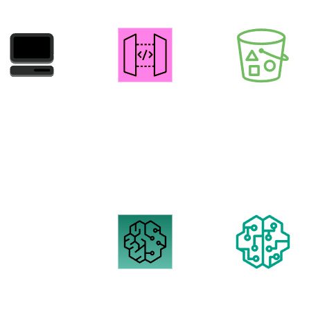

# SageMaker CDK Demo 

This project is a demo implementation of a Text Classification AI using SageMaker in CDK.

## Architecture

We use an [ApiGateway](https://aws.amazon.com/en/api-gateway/) which handles requests and sends them to a SageMaker Endpoint, that forwards them to the model. The model itself is stored in an [S3-Bucket](https://aws.amazon.com/en/s3/).



## Deploy
After this code has been implemented and the model files are in ```./modeldata```, you can deploy the model, simply by using ```cdk deploy```.

You can test this model by using this curl command.

```batch
curl --request POST \
     --url {apigw-url} \
     --header 'Content-Type: application/json' \
     --data '{"inputs": "Inference with hugging face models and Sagemaker is easy!" }'
```