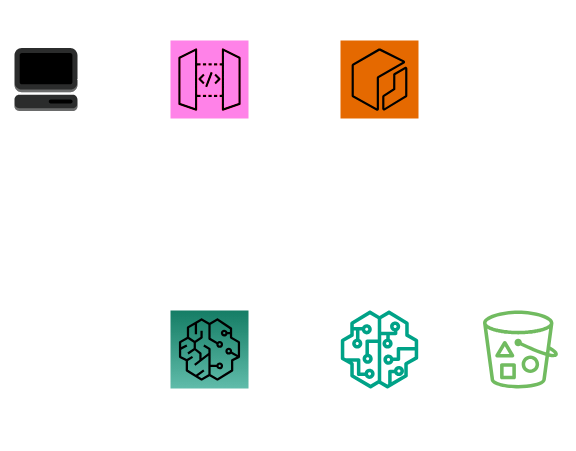

# Welcome to your CDK TypeScript project

This project is a demo implementation of a Text Classification AI using SageMaker in CDK.

## Architecture

This implementation uses an API Gateway which sends requests to a SageMaker Endpoint, that forwards them to the model. The model itself is stored in an S3 Bucket and its image is contained in an ECR container.


## Deploy
Before this model can be deployed, an S3 bucket must be created that contains the [files of the model](https://huggingface.co/distilbert-base-uncased-finetuned-sst-2-english/tree/main). After that you can simply deploy the model with the command ```cdk deploy```

The model can be testet using curl
```batch
curl --request POST \
     --url {apigw-url} \
     --header 'Content-Type: application/json' \
     --data '{"inputs": "Hugging Face, the winner of VentureBeat's Innovation in Natural Language Process/Understanding Award for 2021, is looking to level the playing field." }'
```